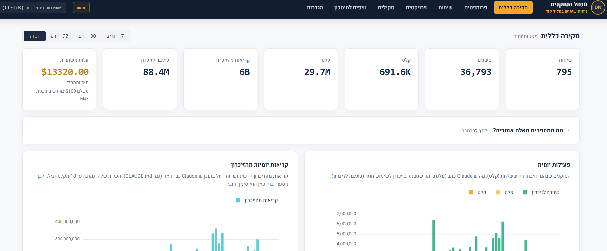
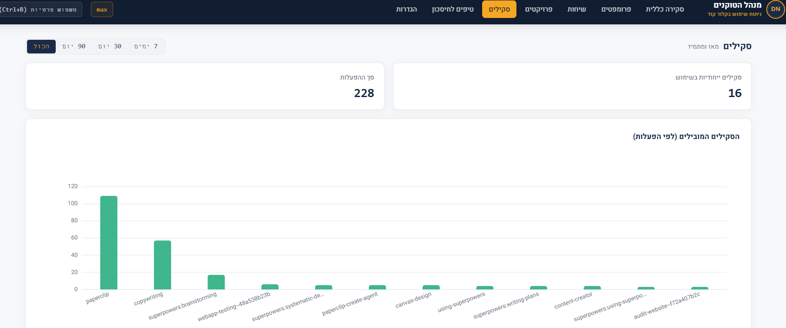

# Token Manager | DN

A local dashboard for analyzing Claude Code token usage. It reads the JSONL transcripts Claude Code stores under `~/.claude/projects/` and turns them into cost views, conversation history, expensive-prompt analytics, tool usage heatmaps, cache analytics, project comparisons, and skill usage breakdowns.





## Fully private

The tool runs entirely on your machine. No telemetry, no data sent out, no calls to any external network. The server listens on `127.0.0.1:8080` only. All assets (ECharts, Heebo, icons) are served locally from the `web/` directory.

For independent verification, see `PRIVACY_AUDIT.md` in the project directory.

## Requirements

- Python 3.8 or newer
- Claude Code installed with at least one existing conversation under `~/.claude/projects/`
- A modern browser (Chrome, Edge, Firefox)
- No `pip install` required. The tool uses the Python standard library only.

## Running

```bash
git clone https://github.com/DvirNaaman/dvir-token-manager.git
cd dvir-token-manager
python cli.py dashboard
```

The command starts the server at `http://127.0.0.1:8080` and opens it automatically in your browser. The server re-scans every 30 seconds and pushes live updates over SSE, so you don't need to refresh manually.

To stop: `Ctrl+C`.

## Additional CLI commands

```bash
python cli.py scan      # manually scan for new JSONL files
python cli.py today     # today's summary in the terminal
python cli.py stats     # all-time summary in the terminal
python cli.py tips      # savings tips based on usage patterns
```

Any command accepts `--db PATH` and `--projects-dir PATH` to override defaults.

## Environment variables

| Variable | Default | Purpose |
|---|---|---|
| `HOST` | `127.0.0.1` | Server listen address |
| `PORT` | `8080` | Server listen port |
| `CLAUDE_PROJECTS_DIR` | `~/.claude/projects` | Source of JSONL files |
| `TOKEN_DASHBOARD_DB` | `~/.claude/token-dashboard.db` | Location of the local SQLite database |

## Privacy blur shortcut

Pressing `Ctrl + B` anywhere in the dashboard blurs prompt text and sensitive content, useful for screenshots. Press again to unblur.

## How to verify zero outbound calls

```bash
grep -rEi "https?://(?!127\.0\.0\.1|localhost)" --include="*.py" --include="*.js" --include="*.html" --include="*.css" .
```

The output should be empty (aside from comments in ECharts LICENSE headers).

## Credits and license

- **Original engine:** [Nate Herk](https://github.com/nateherkai) — author of the original JSONL analyzer and dashboard code, released under the MIT license.
- **Hebrew/RTL adaptation, UI, and branding:** [Dvir Naaman](https://github.com/DvirNaaman) — full UI rewrite, translation, Meridian palette, local Heebo font, tips engine, and iconography.

The project as a whole is distributed under the MIT license (see the `LICENSE` file). You're welcome to use, modify, and distribute it — just preserve both copyright lines in the license file.

## Troubleshooting

**Hebrew text encoded incorrectly in the terminal on Windows:** run `chcp 65001` once in the CMD window before the command, or use PowerShell / Windows Terminal which support UTF-8 by default.

**Dashboard is empty:** make sure at least one conversation exists under `~/.claude/projects/<slug>/<session>.jsonl`. In non-standard environments, point to it manually with `--projects-dir`.

**Port in use:** run with a different port: `PORT=8090 python cli.py dashboard`.
